# Hi there, I'm Kevin Ruef! 👋

## 🚀 About Me
I am a Computer Science student focused on **high-performance systems**, **memory safety**, and **scalable backend architectures**. I enjoy bridging the gap between low-level efficiency and robust enterprise solutions.

- 🦀 **Rust Enthusiast:** Building safe and concurrent systems.
- ⚙️ **Systems Programming:** Leveraging C++ for performance-critical applications.
- ☕ **Enterprise Solutions:** Developing scalable backends with Java.
- 🐍 **Scripting & AI:** Using Python for rapid prototyping and data automation.

---

## 🛠 Tech Stack

## 📈 GitHub Stats

  

---

## 🔭 Current Focus
- 🏗️ Building my portfolio website
- 🛡️ Rust-based security tools
- ☁️ Exploring Cloud-Native architectures and Agentic AI

## 📫 Let's Connect

